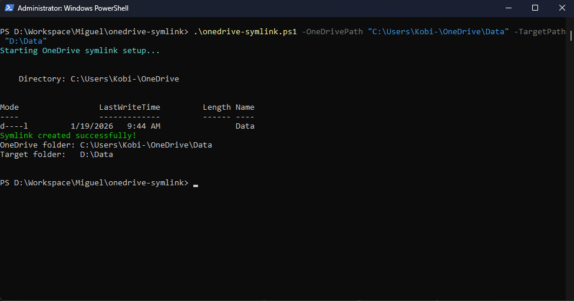

# OneDrive Symlink Sync (PowerShell)

This project enables automatic synchronization between a local folder and OneDrive using a symbolic link.

## Why use this?
- No manual copying
- OneDrive syncs files automatically
- Works with existing folder structures

## Requirements
- Windows 10/11
- PowerShell 5.1+
- OneDrive desktop app installed and running
- Administrator privileges

## Usage

1. Open PowerShell as Administrator
2. Run the following command:

```powershell
Set-ExecutionPolicy -Scope Process -ExecutionPolicy Bypass
.\onedrive-symlink.ps1 -OneDrivePath "C:\Users\<YourUsername>\OneDrive\MyFolder" -TargetPath "D:\MyData"
```

### Parameters

- **OneDrivePath**: Local OneDrive directory where the symlink will be created (must not already exist)
- **TargetPath**: Local folder to be synced - the real folder outside of OneDrive

### Example

```powershell
.\onedrive-symlink.ps1 -OneDrivePath "C:\Users\Kobi-\OneDrive\Data" -TargetPath "D:\Data"
```

## How It Works

The script performs the following steps:

1. Validates that the target folder exists
2. Checks that the OneDrive path does not already exist
3. Creates a symbolic link inside OneDrive pointing to the target folder
4. Enables automatic syncing of files between both locations

## Notes

- Always place the symlink **inside** OneDrive
- The target folder should be **outside** OneDrive to avoid conflicts
- Avoid creating symlink loops (circular references)
- Requires Administrator privileges to create symbolic links

## Result

Once the symbolic link is created successfully, any changes made in either location will stay synced automatically through OneDrive.



## Troubleshooting

### "Failed to create symlink"
- Ensure PowerShell is running as Administrator
- Verify both paths are accessible
- Check that OneDrive path doesn't already exist

### OneDrive not syncing
- Ensure OneDrive desktop app is running
- Check that the target folder is not already being synced separately
- Allow time for initial sync to complete

## License

This project is provided as-is for personal and commercial use.
